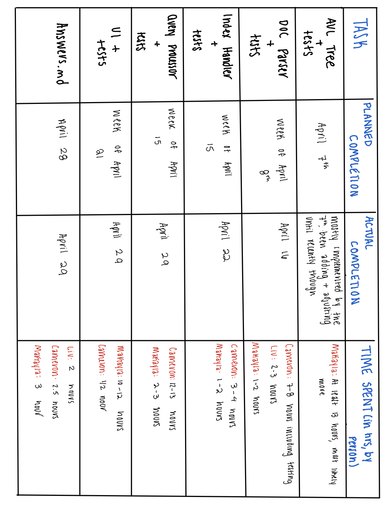
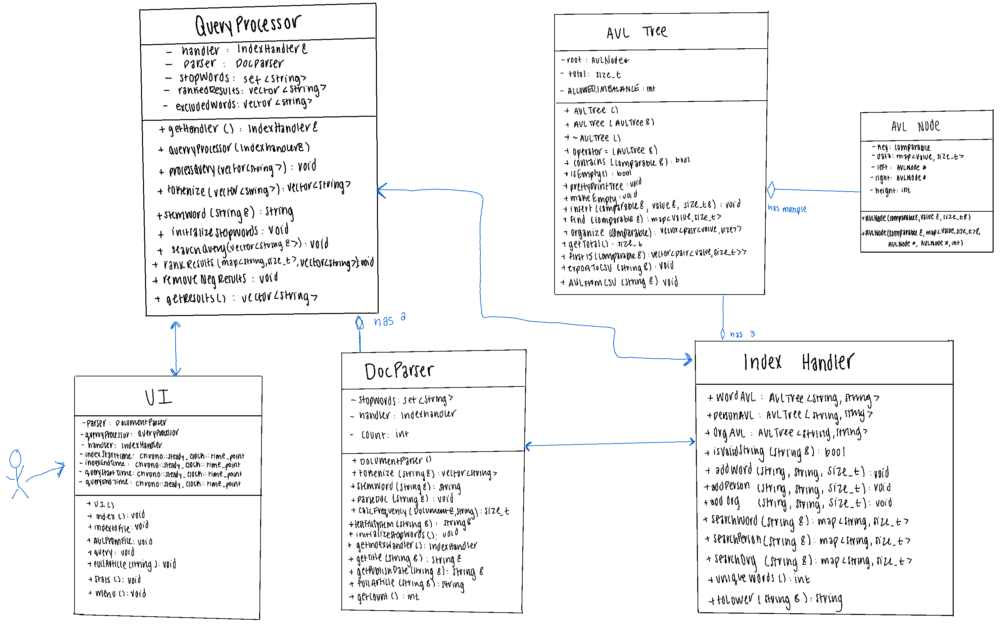
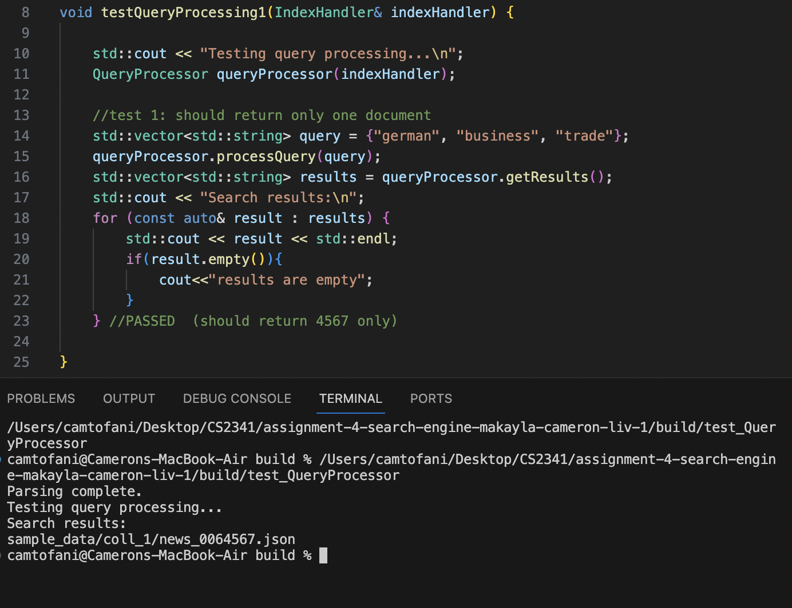
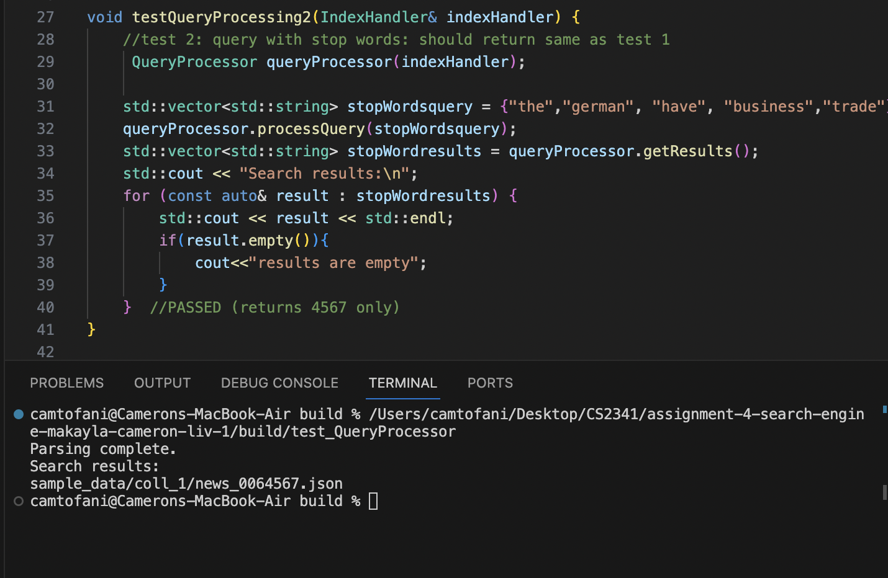
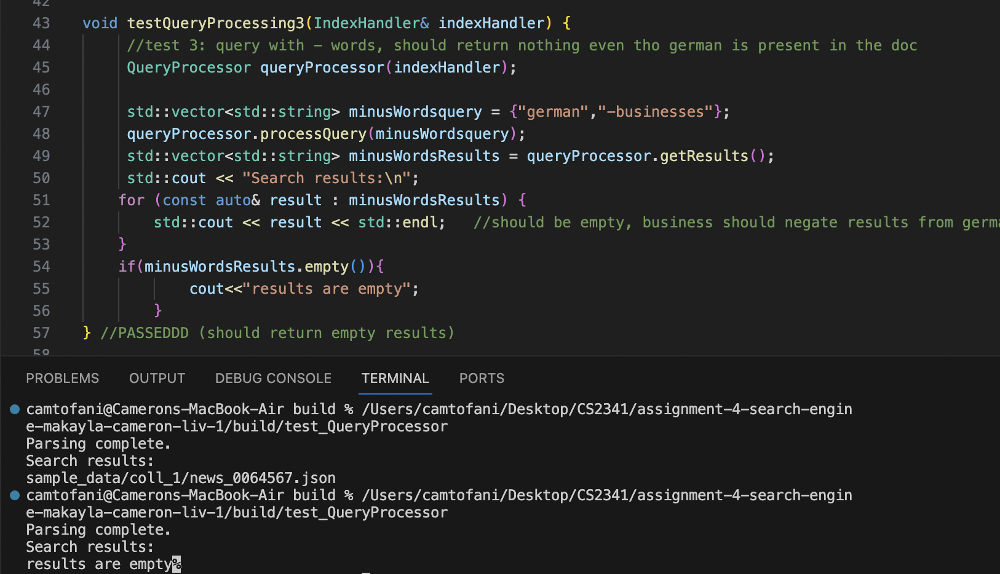
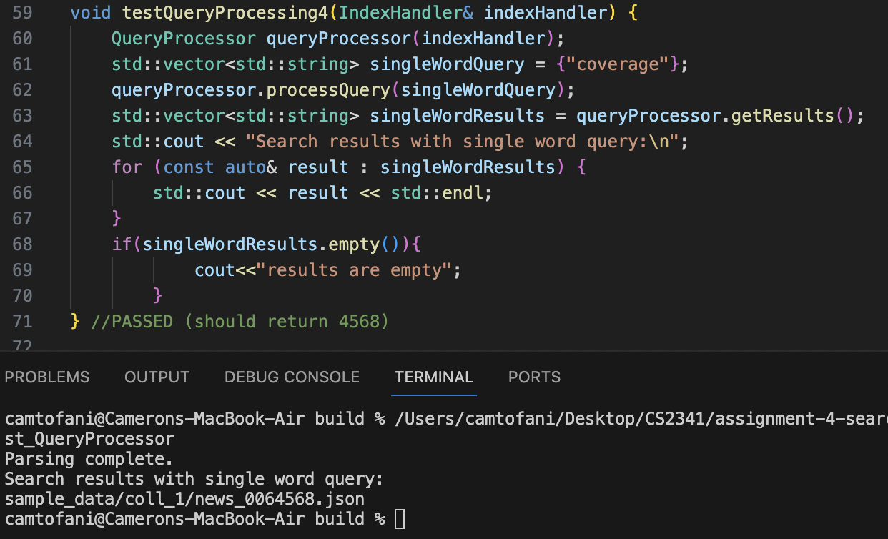
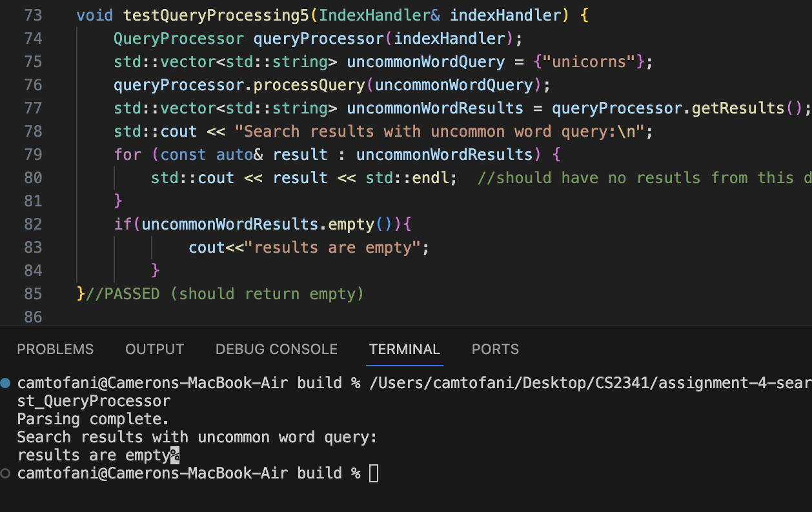
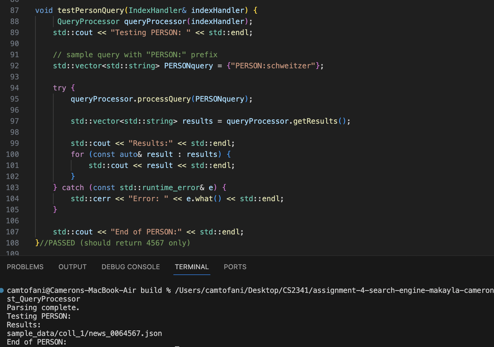
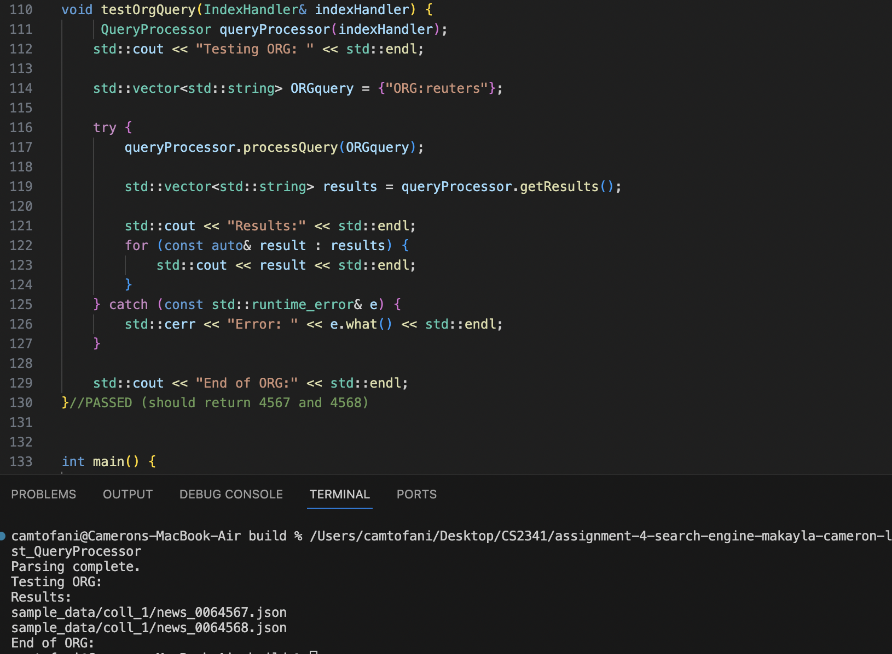

# Assignment 4: Answers

**Complete this document, commit your changes to Github and submit the repository URL to Canvas.** Keep your answers short and precise.

Names of all team members: Makayla Alston, Cameron Tofani, Liv Tirjan

Used free extension: [x] 24 hrs or [ ] 48 hrs

[ ] Early submission (48 hrs)

[ ] Bonus work. Describe: ...

Place [x] for what applies.

## Answers

### Project Management

Complete the tasks and planned completion columns **BEFORE** You start with 
coding!

Weekly milestones/tasks. Set out a plan at the beginning and then record when you got it done.

### High-level Design of Solution

- Add a UML class diagram, etc.

- High-level pseudo code for each component.
For pseudocode, see "pseudocode.md" file
[pseudocode](pseudocode.md)

### Used Data Structures
Explanation of what data structures are used where. For each, state
    - time and space complexity (Big-Oh),
    - why it is the appropriate data structure and what other data structure could have been used.

DocParser
    Data structures used: vector & set
    Time Complexity:
        Vector: O(1) for adding elements at the end, O(n) for accessing randomly or inserting/deleting in the middle.
        Set: O(log n) for insertions, deletions, and lookups
    Space Complexity:
        Vector: O(n) 
        Set: O(n) 
    Why they are appropriate data structures:
        Vector: ideal for storing words because vectors provide fast access to data and are efficient in terms of memory when elements are added at the end.
        Set: Perfect for stopwords because it offers efficient search, insertion, and deletion operations. The log(n) complexity for these operations ensures performance remains manageable even as the set size grows, which is important for checking stopwords frequently during parsing.
    What other data structure could've been used:
        Vector: we could've used a list instead, but they don't provide as efficient random access. 
        Set: we could've used an unordered set since the order of the stopwords isn't important for faster performance, but it would cost us higher memory consumption and worse worst-case performance. 

Node
    Data structures used: inside of the Node struct in the AVLTree we implemented a map to associate document file paths with their respective frequencies of the keyword (key of the node).
    Time Complexity: search, insert, and delete are O(log n)
    Space Complexity: O(n)
    Why it's an appropriate data structure: 
        - keeps its keys sorted, which is beneficial for data traversal
        - efficiently associates two pieces of data (document path and frequency) which is essential for the indexing/retrieval
        - maps can dynamically grow as documents are added to the index
    Alternative data structures: we could've used a vector or array, but this would lose the quick search and insertion benefits of a map and resizing the array is costly

IndexHandler
    Data structure used: AvlTree instance-- Each tree associates a key (word, person, or organization name) with a map that tracks document file paths and the frequencies of occurrences.
    Time Complexity: insert/search/delete is O(log n) and balancing is O(1)
    Space Complexity: O(n)
    Why it's appropriate: self-balancing, ordered access, dynamic data handling
    Alternatives: hash tables offer fast access times but they lack the order and efficient range of query capabilities provided by the AVL tree

Query Processor:
    Data structures used: vector to store tokenized and processed query terms, map used to rank ndocument paths based on their frequencies, set used for stop words
    Time Complexity:
        Vector:  tokenization is O(n)
        Map: O(log n) for insertions, deletions, and lookup
        Set: O(log n) for stop word checking
    Space Complexity:
        Vector: O(n)
        Map: O(n)
        Set: O(n)
    Why it's appropriate: 
        Vector: vectors are ideal since size changes as words are added/removed during processing
        Map: maps provide sorted order and efficient lookups, inserts, and deletions, which are essential for ranking and aggregating document data based on search relevance
        Set: ensures that each stopword is stored only once and provides efficient lookups, which is critical for the quick processing of query terms against a list of stopwords.
    Alternatives: 
        Vector: could use a list, but it would have slower random access
        Map: could use unordered map for faster average-case performance, but without the benefit of sorted keys.
        Set: could use unordered set but would have higher space consumption

### User Documentation
- What are the features of your software?
Advanced Text Processing: Utilizes tokenization, stemming, and stopword removal to prepare text data for efficient searching.
Entity Recognition: Distinguishes between general terms, names of people, and names of organizations in queries to provide more focused search results.
Relevancy Ranking: Implements term frequency for ranking documents based on the relevance of the search terms to provide the most pertinent results at the top.
AVL Tree Indexing: Utilizes AVL trees for maintaining a balanced search index, ensuring quick insertions and searches.
Robust Data Handling: Capable of handling large datasets and complex queries efficiently through optimized data structures.

- Describe how to use the software.
Starting the Software: Launch the application from the terminal or command line interface by running the executable file. 
Entering Queries: Use the search bar to type in your query. Queries can be plain text for simple searches or include special operators for advanced searches:
Use PERSON:<name> to look for documents mentioning a specific person.
Use ORG:<organization> to find documents that reference a particular organization.
Prefix a term with - to exclude documents containing that term.
Viewing Results: After submitting the query, the results will be displayed in order of relevance. Each result will provide a document title, a snippet containing the query terms, and a link or method to access the full document.

- Some example queries with the results.

### Performance
- Provide statistics (word counts, timing, etc) for indexing all documents (or as many as you can in a reasonable amount of time).
***TODO: fill out when code is finalized 

### Bonus Work
Did you attempt any bonuses? If so, please give a brief description of what you did.

   > Your answer
